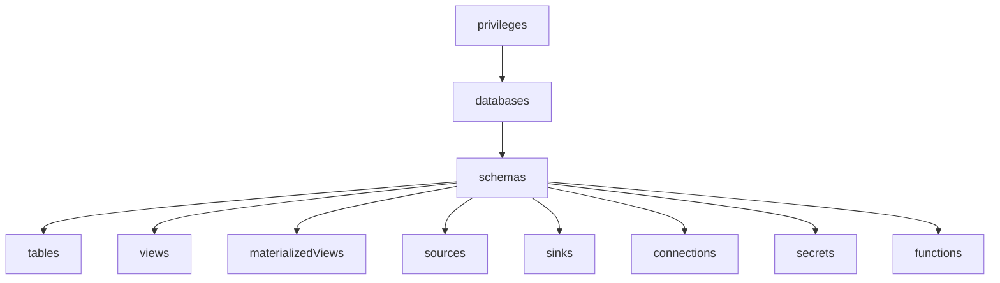

# RisingWave User Management

The RisingWave Operator provides a Kubernetes-native way to manage database users for RisingWave clusters through the `RisingWaveUser` custom resource.

This guide covers:
- [Connecting to a Cluster](#connecting-to-a-cluster)
- [Admin Credentials](#admin-credentials)
- [Basic User Creation](#basic-user-creation)
- [Password Management](#password-management)
- [Privilege Grants](#privilege-grants)
- [Authentication Methods](#authentication-methods)
- [User Operations](#user-operations)
- [Retrieving Credentials](#retrieving-credentials)

---

## Connecting to a Cluster

`RisingWaveUser` must know **which RisingWave instance to connect to** in order to execute user management SQL. There are two mutually exclusive ways to specify this. Exactly one must be set.

### Option 1: `risingWaveRef` — Operator-managed cluster

Use this when the cluster is deployed and managed by the RisingWave Operator (via a `RisingWave` CR). The operator automatically discovers the frontend service endpoint.

```yaml
spec:
  risingWaveRef:
    name: risingwave-sample        # Name of the RisingWave CR
    namespace: default             # Optional — defaults to same namespace as RisingWaveUser
```

The operator waits until the referenced `RisingWave` CR reaches `Running` status before managing the user.

### Option 2: `connectionRef` — External or directly connected cluster

Use this when the cluster was **not** deployed via the operator (e.g., Helm, standalone, cloud-managed) or when you want to manage users independently without a `RisingWave` CR.

```yaml
spec:
  connectionRef:
    host: my-risingwave-frontend.default.svc.cluster.local   # Required
    port: 4567                                               # Optional, default: 4567
```

With `connectionRef`, the operator connects directly to the given host/port and has **no readiness gate** — it attempts the connection immediately.

> [!IMPORTANT]
> `risingWaveRef` and `connectionRef` are mutually exclusive. Specifying both — or neither — is a validation error. The connection type also **cannot be changed** after the resource is created.

---

## Admin Credentials

Both `risingWaveRef` and `connectionRef` support an optional `credentials` block for specifying how the operator authenticates to RisingWave as an admin in order to run user management SQL.

```yaml
credentials:
  username: root          # Optional, defaults to "root"
  password: mypassword    # Optional plaintext — use passwordSecretRef in production
  passwordSecretRef:      # Optional — takes precedence over password
    name: rw-admin-secret
    namespace: default    # Optional
    key: password         # Optional, defaults to "password"
```

**Resolution priority:**
1. `passwordSecretRef` — password read from a Kubernetes Secret key
2. `password` — plaintext value in the spec
3. Neither set → connects with username `root` and **empty password** (default RisingWave install)

> [!NOTE]
> The `password` field stores credentials in plaintext in the Kubernetes API. It is acceptable for development and testing, but `passwordSecretRef` is recommended for production.

### Examples

```yaml
# Operator-managed cluster with admin secret
spec:
  risingWaveRef:
    name: risingwave-sample
    credentials:
      passwordSecretRef:
        name: rw-admin-credentials
        key: password

# External cluster with plaintext password (dev/test only)
spec:
  connectionRef:
    host: my-risingwave-frontend.default.svc.cluster.local
    credentials:
      username: root
      password: my-admin-password

# No credentials block — connects as root with empty password
spec:
  risingWaveRef:
    name: risingwave-sample
```

---

## Basic User Creation

### Minimal User

The simplest way to create a user with auto-generated password:

```yaml
apiVersion: risingwave.risingwavelabs.com/v1alpha1
kind: RisingWaveUser
metadata:
  name: my-user
spec:
  risingWaveRef:
    name: risingwave-sample
```

This creates a user named `my-user` in RisingWave with:
- Auto-generated 16-character password
- Default database connection privileges
- Secret created at `risingwave-risingwave-sample-my-user`

### Minimal User via Direct Connection

```yaml
apiVersion: risingwave.risingwavelabs.com/v1alpha1
kind: RisingWaveUser
metadata:
  name: my-user
spec:
  connectionRef:
    host: my-risingwave-frontend.default.svc.cluster.local
    port: 4567
```

This creates the same user but connects directly. Secret is created at `risingwave-direct-my-user`.

### User with Custom Name

Use `spec.name` to set a different RisingWave username than the Kubernetes resource name:

```yaml
apiVersion: risingwave.risingwavelabs.com/v1alpha1
kind: RisingWaveUser
metadata:
  name: my-user-resource     # Kubernetes resource name
spec:
  risingWaveRef:
    name: risingwave-sample
  name: "my_db_user"         # Actual RisingWave username
```

### User with Database Permissions

Grant user-level permissions:

```yaml
apiVersion: risingwave.risingwavelabs.com/v1alpha1
kind: RisingWaveUser
metadata:
  name: developer-user
spec:
  risingWaveRef:
    name: risingwave-sample
  permissions:
    - CREATEDB    # Can create databases
    - CREATEUSER  # Can create other users
```

**Available User Permissions:**
- `SUPERUSER` - Full superuser privileges
- `CREATEDB` - Can create databases
- `CREATEUSER` - Can create other users
- `NOSUPERUSER` - Explicitly remove superuser
- `NOCREATEDB` - Remove database creation privilege
- `NOCREATEUSER` - Remove user creation privilege

---

## Password Management

### Auto-Generated Password

By default, a 16-character random password is generated. Customize length:

```yaml
spec:
  risingWaveRef:
    name: risingwave-sample
  password:
    generateRandomLength: 32  # 8-128 characters allowed
```

### Password from Secret

Reference an existing secret:

```yaml
spec:
  risingWaveRef:
    name: risingwave-sample
  password:
    secretRef:
      name: my-existing-password
      namespace: default  # Optional, defaults to RisingWaveUser namespace
      key: password       # Optional, defaults to "password"
```

**Secret Format:**
```yaml
apiVersion: v1
kind: Secret
metadata:
  name: my-existing-password
type: Opaque
stringData:
  password: "my-secure-password"
```

### Password Rotation

Trigger password rotation by adding an annotation:

```bash
kubectl annotate risingwaveuser my-user "risingwave.risingwavelabs.com/rotate-password=true" --overwrite
```

The operator will:
1. Generate a new random password
2. Update the RisingWave user
3. Update the Kubernetes Secret
4. Remove the annotation

**Note:** The operator only honors this annotation when using auto-generated passwords. If you use `secretRef`, rotate the password manually in the secret.

---

## Privilege Grants

The `grants` section allows fine-grained access control on database objects using a **hierarchical structure**. Database and schema context is specified once at the parent level.

### Structure Overview



### Hierarchical Structure Example

```yaml
spec:
  grants:
    databases:
      - name: "dev"
        privileges: [CONNECT, CREATE]
        withGrantOption: true
        schemas:
          - name: "public"
            privileges: [USAGE, CREATE]
            tables:
              - name: "orders"
                privileges: [SELECT, INSERT, UPDATE]
            views:
              - name: "*"  # All views in this schema
                privileges: [SELECT]
```

### Supported Objects and Privilege Types

| Level | Object Type | Supported Privileges |
|-------|-------------|----------------------|
| Database | `databases` | `CONNECT`, `CREATE`, `ALL` |
| Schema | `schemas` | `USAGE`, `CREATE`, `ALL` |
| Table | `tables` | `SELECT`, `INSERT`, `UPDATE`, `DELETE`, `ALL` |
| View | `views` | `SELECT`, `ALL` |
| Materialized View | `materializedViews` | `SELECT`, `ALL` |
| Source | `sources` | `SELECT`, `ALL` |
| Sink | `sinks` | `SELECT`, `ALL` |
| Connection | `connections` | `USAGE`, `ALL` |
| Secret | `secrets` | `USAGE`, `ALL` |
| Function | `functions` | `EXECUTE`, `ALL` |

### Wildcard Support

Use `"*"` as the name to grant privileges on all objects of that type within a schema:

```yaml
grants:
  databases:
    - name: "dev"
      schemas:
        - name: "*"      # All schemas in 'dev'
          tables:
            - name: "*"  # All tables in all schemas
              privileges: [SELECT]
```

---

## Authentication Methods

### Password Authentication (Default)

If `auth` is not specified, password authentication is used:

```yaml
spec:
  # auth section omitted - defaults to password
  password:
    generateRandomLength: 16
```

### OAuth Authentication

For OAuth/JWT-based authentication:

```yaml
apiVersion: risingwave.risingwavelabs.com/v1alpha1
kind: RisingWaveUser
metadata:
  name: oauth-user
spec:
  risingWaveRef:
    name: risingwave-sample
  auth:
    type: oauth
    oauth:
      jwksUrl: "https://auth.example.com/.well-known/jwks.json"
      issuer: "risingwave"
      audience:
        - "risingwave"
        - "https://myapp.example.com"
```

**OAuth Configuration:**
- `jwksUrl` - JWKS (JSON Web Key Set) endpoint for token verification (required)
- `issuer` - Issuer claim to verify in JWT token (required)
- `audience` - Audience claims to verify (optional)

### LDAP Authentication

For LDAP-based authentication:

```yaml
apiVersion: risingwave.risingwavelabs.com/v1alpha1
kind: RisingWaveUser
metadata:
  name: ldap-user
spec:
  risingWaveRef:
    name: risingwave-sample
  auth:
    type: ldap
    ldap:
      host: "ldap.example.com"
      port: 389                     # Optional, default: 389
      baseDN: "dc=example,dc=com"
      useSSL: true                  # Optional
      insecureSkipVerify: false     # Optional
```

**LDAP Configuration:**
- `host` - LDAP server hostname or IP (required)
- `port` - LDAP server port (optional, default: 389)
- `baseDN` - Base DN for LDAP searches (required)
- `useSSL` - Use SSL/TLS for connections (optional)
- `insecureSkipVerify` - Skip TLS certificate verification (optional)

---

## User Operations

### Cross-Namespace Reference

Reference a RisingWave cluster in a different namespace:

```yaml
apiVersion: risingwave.risingwavelabs.com/v1alpha1
kind: RisingWaveUser
metadata:
  name: my-user
  namespace: app-namespace          # User namespace
spec:
  risingWaveRef:
    name: risingwave-sample
    namespace: database-namespace   # Cluster namespace
```

### Deleting a User

```bash
kubectl delete risingwaveuser my-user
```

The operator will:
1. Execute `DROP USER` in RisingWave
2. Delete the Kubernetes Secret containing the password
3. Remove finalizers from the resource

### Pausing Reconciliation

To pause all reconciliation for a user:

```bash
kubectl annotate risingwaveuser my-user "risingwave.risingwavelabs.com/pause-reconcile=true"
```

---

## Retrieving Credentials

The operator stores user credentials in a Kubernetes Secret. The secret name depends on the connection mode:

| Connection mode | Secret name pattern |
|-----------------|---------------------|
| `risingWaveRef` | `risingwave-<cluster-name>-<resource-name>` |
| `connectionRef` | `risingwave-direct-<resource-name>` |

**Examples:**

| Resource name | Cluster / mode | Secret name |
|---------------|----------------|-------------|
| `analytics-user` | `risingWaveRef`, cluster `risingwave-sample` | `risingwave-risingwave-sample-analytics-user` |
| `analytics-user` | `connectionRef` (direct) | `risingwave-direct-analytics-user` |

### Get Secret

```bash
# risingWaveRef mode
kubectl get secret risingwave-risingwave-sample-analytics-user -o yaml

# connectionRef mode
kubectl get secret risingwave-direct-analytics-user -o yaml
```

### Extract Password

```bash
kubectl get secret risingwave-risingwave-sample-analytics-user \
  -o jsonpath='{.data.password}' | base64 -d
```

### Use with psql

```bash
# Port forward to RisingWave
kubectl port-forward svc/risingwave-sample-frontend 4567:service

# Get password and connect
PASSWORD=$(kubectl get secret risingwave-risingwave-sample-analytics-user \
  -o jsonpath='{.data.password}' | base64 -d)
psql -h localhost -p 4567 -d dev -U analytics-user -W <<< "$PASSWORD"
```

---

## Status and Conditions

Monitor the user status:

```bash
kubectl get risingwaveuser my-user -o yaml
```

**Status Fields:**
- `status.phase` - High-level lifecycle phase (Pending, Creating, Ready, Updating, Deleting, Failed)
- `status.userCreated` - Whether user exists in RisingWave
- `status.secretCreated` - Whether password secret exists
- `status.privilegesSynced` - Whether privileges have been applied
- `status.connectionStatus.connected` - Whether operator can connect to RisingWave
- `status.secretName` - Name of the password secret

**Conditions:**
- `Ready` - User is fully provisioned
- `UserCreated` - User created in RisingWave
- `SecretCreated` - Password secret created
- `PrivilegesSynced` - Privileges applied
- `ConnectionError` - Connection to RisingWave failed

> [!NOTE]
> When using `connectionRef`, the `Pending` phase is skipped — the operator does not wait for a RisingWave CR readiness condition. If the connection fails, the user goes directly to `Failed`.

---

## Common Patterns

### Read-Only Analytics User (operator-managed cluster)

```yaml
apiVersion: risingwave.risingwavelabs.com/v1alpha1
kind: RisingWaveUser
metadata:
  name: analytics-readonly
spec:
  risingWaveRef:
    name: risingwave-sample
  grants:
    databases:
      - name: analytics
        privileges: [CONNECT]
        schemas:
          - name: public
            privileges: [USAGE]
            tables:
              - name: "*"
                privileges: [SELECT]
            views:
              - name: "*"
                privileges: [SELECT]
            materializedViews:
              - name: "*"
                privileges: [SELECT]
```

### Data Ingestion User (external cluster)

```yaml
apiVersion: risingwave.risingwavelabs.com/v1alpha1
kind: RisingWaveUser
metadata:
  name: ingestion-writer
spec:
  connectionRef:
    host: my-risingwave-frontend.default.svc.cluster.local
    credentials:
      passwordSecretRef:
        name: rw-admin-credentials
        key: password
  grants:
    databases:
      - name: production
        privileges: [CONNECT, CREATE]
        schemas:
          - name: ingestion
            privileges: [USAGE, CREATE]
            tables:
              - name: "*"
                privileges: [SELECT, INSERT, UPDATE, DELETE]
            sources:
              - name: "*"
                privileges: [SELECT]
            sinks:
              - name: "*"
                privileges: [SELECT]
```

### Delegated Admin User

User who can grant privileges to others:

```yaml
apiVersion: risingwave.risingwavelabs.com/v1alpha1
kind: RisingWaveUser
metadata:
  name: delegated-admin
spec:
  risingWaveRef:
    name: risingwave-sample
  grants:
    databases:
      - name: dev
        privileges: [ALL]
        withGrantOption: true    # Can grant these privileges to others
```

---

## Troubleshooting

### User Not Created

Check the status and conditions:

```bash
kubectl describe risingwaveuser my-user
```

Look for:
- `ConnectionError` condition — Operator cannot connect to RisingWave
- For `risingWaveRef`: verify the cluster name is correct and the cluster is in `Running` status
- For `connectionRef`: verify the `host` and `port` are reachable from within the cluster

### Connection Refused (connectionRef)

If you see a connection error with `connectionRef`:
1. Verify the host DNS is resolvable from the operator pod
2. Verify the port is correct (default: `4567`)
3. Check admin credentials — if the admin requires a password, ensure `credentials.passwordSecretRef` or `credentials.password` is set
4. Ensure the admin user has `SUPERUSER` or `CREATEUSER` privileges

### Secret Not Found

If the password secret doesn't exist:

```bash
kubectl get secrets | grep risingwave
```

Check `status.secretName` to see the expected secret name, and confirm which mode is in use:
- `risingWaveRef` mode → secret: `risingwave-<cluster>-<user>`
- `connectionRef` mode → secret: `risingwave-direct-<user>`

### Password Rotation Not Working

Ensure:
1. The user uses auto-generated password (not `secretRef`)
2. The annotation is exactly: `risingwave.risingwavelabs.com/rotate-password=true`
3. The annotation value is the string `"true"`

---

## Privilege Grant Structure Reference

```
grants:
  databases:
    - name: "database_name"
      privileges: [CONNECT, CREATE]
      withGrantOption: true
      schemas:
        - name: "schema_name"
          privileges: [USAGE, CREATE]
          withGrantOption: false
          tables:
            - name: "table_name"  # or "*" for all tables
              privileges: [SELECT, INSERT, UPDATE]
          views:
            - name: "view_name"   # or "*" for all views
              privileges: [SELECT]
          materializedViews:
            - name: "mv_name"
              privileges: [SELECT]
          sources:
            - name: "source_name"
              privileges: [SELECT]
          sinks:
            - name: "sink_name"
              privileges: [SELECT]
          connections:
            - name: "connection_name"
              privileges: [USAGE]
          secrets:
            - name: "secret_name"
              privileges: [USAGE]
          functions:
            - name: "function_name"
              privileges: [EXECUTE]
```

---

For complete API reference, see [API Documentation](api.md).
